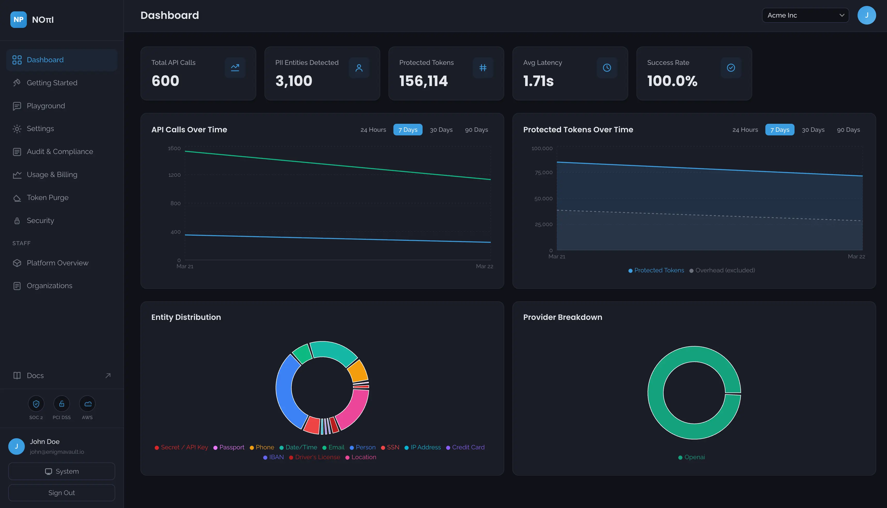

# NoPII Examples

[](https://github.com/Enigma-Vault/nopii-examples/actions/workflows/ci.yml)

**PII-tokenizing proxy for LLM APIs. One line of code. Zero middleware.**

NoPII sits between your application and your LLM provider. It detects PII in outbound requests, replaces it with deterministic tokens, and restores the original values in responses. Your app works with real data. The LLM never sees it.

You register your upstream LLM API keys in the NoPII admin console. You retain full ownership and control. NoPII uses them to forward sanitized requests on your behalf.

```python
# Before: PII goes straight to OpenAI
client = OpenAI(api_key="sk-...")

# After: PII is intercepted and tokenized
client = OpenAI(api_key="sk-...", base_url="https://api.nopii.co/v1")
```

For most SDK-based integrations, that's the only code change required.

> **Built on Enigma Vault.** PCI DSS Level 1 certified, SOC 2 Type II audited, AWS Partner. [Security details →](./docs/security.md)

---

## Architecture

```
                        ┌──────────────────────────────┐
                        │         NoPII Proxy          │
                        │                              │
┌───────────┐  request  │  ┌────────┐    ┌──────────┐  │  sanitized   ┌──────────────┐
│           │──────────▶│  │Detect  │───▶│Tokenize  │  │─────────────▶│              │
│  Your App │           │  │  PII   │    │(Vault)   │  │              │ LLM Provider │
│           │◀──────────│  │        │◀───│          │  │◀─────────────│ (OpenAI,     │
└───────────┘  response │  └────────┘    └──────────┘  │  response    │  Anthropic,  │
                        │                              │              │  etc.)       │
  Real PII              │  Detokenize on the way back  │              └──────────────┘
  in and out            └──────────────────────────────┘   LLM only
                                                           sees tokens
```

**Fail-safe:** If NoPII cannot tokenize a request, the request is **blocked**. PII never leaks to the LLM provider.

---

## Quick start

### 1. Sign up and register your LLM keys

Sign up at [app.nopii.co](https://app.nopii.co) and register your LLM API keys in the admin console. The free tier includes 1M protected tokens per month, no credit card required.

### 2. Set your environment variables

```bash
cp .env.example .env
```

```env
NOPII_BASE_URL=https://api.nopii.co/v1
OPENAI_API_KEY=sk-...
ANTHROPIC_API_KEY=sk-ant-...
```

> **Note:** Anthropic's SDK appends `/v1/` internally. The Anthropic examples handle this automatically. See [Provider Compatibility](./docs/providers.md) for details.

### 3. Run an example

**Python:**

```bash
cd openai-chat
pip install -r requirements.txt
python main.py
```

**Node.js/TypeScript:**

```bash
cd openai-chat-node
npm install
npm start
```

---

## Examples

| Example | Provider | What it demonstrates |
|---------|----------|----------------------|
| [openai-chat](./openai-chat) | OpenAI | Basic chat completion with PII protection |
| [openai-streaming](./openai-streaming) | OpenAI | Streaming with credential and secret detection |
| [anthropic-chat](./anthropic-chat) | Anthropic | Chat completion via NoPII's Anthropic endpoint |
| [anthropic-streaming](./anthropic-streaming) | Anthropic | Streaming with API key and token detection |
| [multi-turn](./multi-turn) | OpenAI | Multi-turn conversation showing deterministic tokenization |
| [langchain](./langchain) | OpenAI | LangChain integration via `base_url` |
| [langchain-anthropic](./langchain-anthropic) | Anthropic | LangChain + ChatAnthropic via `anthropic_api_url` |
| [langgraph](./langgraph) | OpenAI | LangGraph agentic workflow with PII protection across nodes |
| [llamaindex](./llamaindex) | OpenAI | LlamaIndex integration via `api_base` |
| [deepseek](./deepseek) | DeepSeek | DeepSeek via OpenAI-compatible endpoint |
| [gemini](./gemini) | Google Gemini | Gemini via OpenAI-compatible endpoint |
| [openai-chat-node](./openai-chat-node) | OpenAI | Node.js/TypeScript chat completion with PII protection |
| [multi-provider](./multi-provider) | Multiple | Same PII protection across OpenAI, Anthropic, and DeepSeek |

---

## See it in action

**What your app sends:**

```
Summarize the customer record for John Smith.
His SSN is 234-56-7891 and his email is john.smith@acme.com.
He called from 555-867-5309 about his credit card 4242-4242-4242-4242.
```

**What the LLM actually sees:**

```
Summarize the customer record for [NAME: VAULT_72GleckHu-1nTA28vPf3].
His SSN is [IDENTIFIER: VAULT_GID5xlonM5zvle5Iu1mH] and his email is [EMAIL: VAULT_XfOH_WZfEOEDr7D7AIv-].
He called from [PHONE: VAULT_WcC0pvw8Oyxun8ADdtwG] about his credit card [IDENTIFIER: VAULT_SB5gqMqE6emYWkyAElp5].
```

**What your app gets back:**

```
Here is a summary of the customer record for John Smith:
- SSN: 234-56-7891
- Email: john.smith@acme.com
- Phone: 555-867-5309
- Credit card: 4242-4242-4242-4242
```

The LLM never saw John Smith's real data. Your app never noticed anything changed.

### Dashboard

Every request is tracked in the admin console — API calls, PII entities detected, protected tokens, latency, and provider breakdown.



---

## Deterministic tokenization

The same PII value always produces the same token within your account. This is what makes multi-turn conversations work: the LLM recognizes the same entity across turns without ever seeing the real value.

```python
# Turn 1: "Schedule a meeting with John Smith at john@acme.com"
# LLM sees: "Schedule a meeting with [NAME: VAULT_72GleckHu] at [EMAIL: VAULT_Sy2Hhb]"

# Turn 3: "Actually, send John Smith the notes"
# LLM sees: "Actually, send [NAME: VAULT_72GleckHu] the notes"
```

This is the critical difference between NoPII and naive redaction. Redaction destroys context. Deterministic tokenization preserves it.

---

## Supported scenarios

| Scenario | Status | Notes |
|----------|--------|-------|
| Chat completions | **Supported** | OpenAI, Anthropic, DeepSeek, Gemini, and other OpenAI-compatible APIs |
| Streaming | **Supported** | Real-time detokenization of streamed chunks |
| Multi-turn conversations | **Supported** | Deterministic tokens maintain entity consistency across turns |
| LangChain / LlamaIndex | **Supported** | Drop-in via `base_url`, generally works without application rewrites |
| LangChain + ChatAnthropic | **Supported** | Via `anthropic_api_url` — same `.removesuffix("/v1")` pattern |
| LangGraph | **Supported** | PII protected across all graph nodes and edges |
| Tool / function calling | **Supported** | PII in tool arguments and responses is tokenized/detokenized |
| JSON mode / structured output | **Supported** | Tokenization preserves JSON structure |
| Embeddings | Partial | Exact-match retrieval works (deterministic tokens match at query time). Fuzzy/semantic similarity over PII values does not |
| Fine-tuning | Partial | Works if you also infer with NoPII. The model won't learn generalizable patterns about PII as a category |
| Image / audio inputs | Not supported | NoPII operates on text only |
| Batch API | Not yet tested | May work if the batch endpoint is OpenAI-compatible |

---

## When not to use NoPII

- **No PII in your prompts.** Pure code generation, math, public data summarization. The proxy adds an unnecessary hop.
- **Fuzzy or semantic search over PII values.** Deterministic tokens enable exact-match retrieval, but "John Smith" and "Jon Smith" are unrelated strings once tokenized. If you need similarity matching across PII, NoPII will break that.
- **Fine-tuning where the model needs to generalize about PII.** If you train and infer with NoPII, the model can learn patterns around consistent tokens. But it won't learn what names, emails, or SSNs are as a category.
- **Non-text modalities.** PII in images or audio is not detected.
- **LLM needs to operate on PII values directly.** E.g., "sort these SSNs numerically." The LLM sees tokens, not values.

---

## Trust and failure behavior

Enigma Vault is **PCI DSS Level 1** certified, **SOC 2 Type II** audited, and an **AWS Partner**.

NoPII does not store request or response bodies. PII detections are logged for audit (entity type, confidence, timestamp) but original values are not logged. Tokenization is handled by [Enigma Vault](https://www.enigmavault.io)'s Data Vault. Tokens are scoped per account with full tenant isolation.

If NoPII cannot tokenize a request, the request is blocked. If detokenization fails on a response, vault tokens remain visible (the safe direction). Unrecognized PII passes through, so tune your detection settings and test with representative data before production.

PII detection adds processing overhead per request. Benchmark with your actual workload. Streaming detokenization happens per-chunk with no buffering.

> **Deeper dives:** [Security & Trust](./docs/security.md) · [Operational Notes](./docs/operations.md) · [Detection Catalog](./docs/detection.md) · [Provider Compatibility](./docs/providers.md) · [FAQ](./docs/faq.md)

---

## Links

- [Documentation](https://docs.nopii.co): Quickstart, API reference, and integration guides
- [Admin Console](https://app.nopii.co): Sign up and manage your configuration
- [Website](https://www.nopii.co): Product overview
- [Pricing](https://www.nopii.co/pricing): Free tier and Pro plans

## License

The examples in this repository are licensed under the MIT License. NoPII itself is a commercial product by [Enigma Vault](https://www.enigmavault.io).
